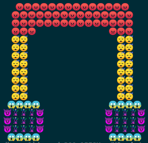

# Headphone_design
I have displayed a output of Headphone_design using python by text allignment in Python. 

Instead printing some letter in text allignment - I used unicode to print different symbols 
and made the text allignment attractive.

**If you want to print some unicode, refer to this following link:**

https://www.fileformat.info/info/unicode/category/So/list.htm

All unicodes are printed by pressing ctrl + shift + U + (unicode_no.)

Instead of typing unicode to generate symobols or emojis - we can even, copy the emoji from net
and paste it inside print() in python

**Ouput of image of python code:** 

Check out my code.
Hope you understand and love this code.
**Thankyou.**
